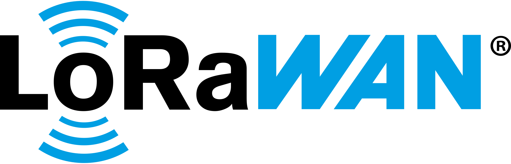
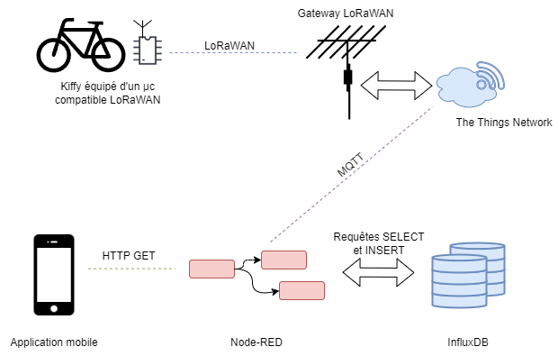

# SAE LoRaWAN
Projet SAE S3 IUT Nice Côte d'Azur Section GEII

Au cours du semestre 3 de notre cursus en BUT Génie Électrique et Informatique
Industrielle (GEII), nous nous lançons dans un projet axé sur la transformation d’un
tricycle électrique en un véhicule "communicant" avec le monde extérieur en embarquant
une carte mBED.

Le Projet SAE LoRaWAN est un projet innovant qui offre de nouvelles perspectives
à la mobilité urbaine en libre-service. Il consiste à établir une réflexion pour équiper
et gérer une flotte de tricycles électriques à Nice. Ce véhicule intelligent sera connecté
au réseau LoRaWAN et pourra envoyer des informations sur la qualité de l’air. Il sera
également géolocalisé pour permettre sa réservation. Ce projet s’inscrit dans le cadre du
développement de la ville de Nice pour en faire une ville intelligente, une « smart city ».
Il s’agit donc d’un projet écologique.

L’accent est particulièrement mis sur le développement des fonctions nécessaires à la
communication entre tricycle et à une plateforme "Smart Cities IoT". Au cœur de cette
initiative se trouve la conception d’une antenne LoRa à 868 MHz, intégrée au système
pour assurer une connectivité fiable et une portée étendue. Lors de ce rapport, nous
évoquerons les étapes de la conception et l’intégration de cette antenne grâce au logiciel
Advanced Design System (ADS) concu par Keysight et RS DesignSpark PCB, puis la
programmation nécessaire pour suivre le cahier des charges imposé.

Par Hugo Meleiro & Marius Deias

> [!NOTE]  
> API Keys have been disabled :)